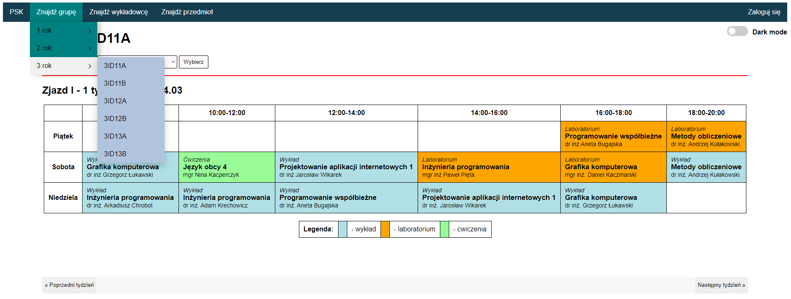
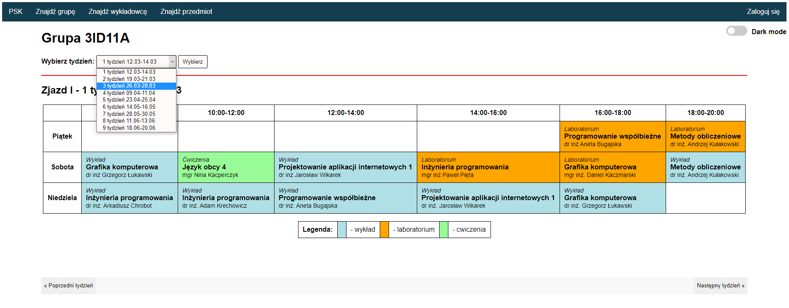
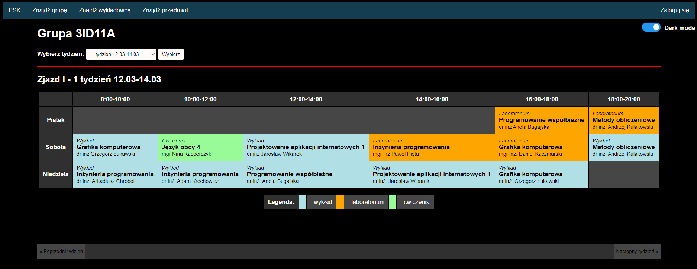
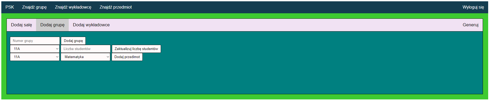

\begin{figure}
    \centering
    \Large Politechnika Świętokrzyska \\
    Wydział Elektrotechniki, Automatyki i Informatyki\\
    \vspace{4cm}

    Grzegorz Bujak\\
    Arkadiusz Markowski\\
    Marcin Majdański\\
    \vspace{3cm}

    \Huge Układanie planu zajęć na studiach niestacjonarnych\\
    \vspace{3cm}

    \large Projekt zespołowy\\
    na studiach stacjonarnych\\
    o kierunku informatyka\\
    \vspace{3cm}

    \raggedleft Opiekun projektu:\\
    Doktor Inżynier Grzegorz Słoń
\end{figure}

\vspace{1cm}

\clearpage

\begin{figure}[H]
    \tableofcontents
\end{figure}

\clearpage

# Charakterystyka zadania

Problem, który postanowiliśmy rozwiązać to układanie planu lekcji na studiach
niestacjonarnych. Problem można interpretować na wiele sposobów. W tym projekcie
traktujemy ten problem jako problem optymalizacji.

Do napisania algorytmu wykorzystaliśmy język Rust. Programy napisane w tym języku
kompilują się do kodu maszynowego i są tak wydajne, jak programy napisane w C++.

Do prezentacji ułożonego planu wykorzystaliśmy HTML.

Kody źródłowe:

* Algorytm w Rust: <https://github.com/gbujak/bfplan>
* Aplikacja internetowa: <https://github.com/arekmarko/projekt-zespolowy>

# Podstawa teoretyczna

## Symulowane wyżarzanie

Symulowane wyżarzanie to rodzaj algorytmu heurystycznego przeszukującego przestrzeń
alternatywnych rozwiązań problemu w celu wyszukania najlepszego. Nazwa algorytmu
bierze się z metalurgii, gdzie metal jest podgrzewany i chłodzony w celu osiągnięcia
struktury krystalicznej o najmniejszej energii.

Przyjmując, że dowolny problem to funkcja matematyczna pewnego stanu $S$, szuka się
stanu, który daje najlepszy wynik (najmniejszą wartość $f(S)$). Algorytm można
przedstawić jako:

1. Wylosuj stan sąsiedni $S'$ do obecnego $S$.
2. Oblicz $f(S')$.
3. Zdecyduj, czy przyjąć stan $S'$. Jeśli nie, przejdź do kroku 1.
4. Ustaw stan $S'$ jako obecny stan. Przejdź do kroku 1.

Decyzja o przyjęciu stanu zależy od $f(S')$ oraz od temperatury. Symulowane
wyżarzanie różni się tym od algorytmu zachłannego, że przy wysokiej temperaturze
akceptuje zmianę stanu, która pogarsza wynik. Dzięki temu, algorytm nie zatrzymuje
się w minimum lokalnym.

Temperatura maleje przy każdej zmianie stanu. Przy niskiej temperaturze, algorytm
zaczyna działać jak algorytm zachłanny. (odwołanie 1) (odwołanie 2)

# Algorytm obliczeniowy

Program, który napisaliśmy implementuje algorytm symulowanego wyżarzania opisany w
poprzedniej sekcji. W tej sekcji, opisaliśmy, w jaki sposób nasz program implementuje
ten algorytm.

Większość czasu działania programu odbywa się w nieskończonej pętli, której działanie
jest opisane w krokach w poprzedniej sekcji. Nasza implementacja algorytmu przerywa
pracę, gdy odrzucone zostanie 1.000.000 zmian stanu z rzędu.

## Przechowywanie stanu programu

Stan planu przechowywany jest w naszym programie za pomocą czterech struktur danych.
Są to: tablica i trzy tablice mieszające. Taka kombinacja znacznie zwiększa
skomplikowanie programu, ale przyspiesza wykonywanie mutacji. Zwykła tablica
przechowuje struktury zawierające dane o pojedynczej lekcji. Są to grupa studencka,
nauczyciel, sala lekcyjna i czas. Tablice mieszające mapują pary czasu i innych
charakterystyk do lekcji, która posiada taką kombinację czasu i charakterystyki. 

W pseudokodzie można to przedstawić jako:

``` typescript
struct PlanLekcji {
    lekcje: Array<{czas: int, grupa: int, nauczyciel: int, sala: int}>,

    czas_sala: HashMap<{czas: int, sala: int}, int>,
    czas_nauczyciel: HashMap<{czas: int, nauczyciel: int}, int>,
    czas_grupa: HashMap<{czas: int, grupa: int}, int>,
}
```

Czas jest przechowywany jako liczba całkowita. Można ją traktować jak ID.

* Czas o wartości "0" to pierwszy dzień zjazdu o godzinie 8:00.
* Czas o wartości "1" to pierwszy dzień zjazdu o godzinie 10:00.
* Czas o wartości "5" to pierwszy dzień zjazdu o godzinie 18:00.
* Czas o wartości "6" to drugi dzień zjazdu o godzinie 8:00.

## Mutacje

Problemem typowej implementacji algorytmu symulowanego wyżarzania do rozwiązania
problemu szukania planu lekcji jest rozmiar stanu. Typowa implementacja algorytmu
wykonuje kopię całego stanu.

Stwierdziliśmy, że kopiowanie stanu planu lekcji byłoby zbyt kosztowne. Z tego
powodu, zaimplementowaliśmy coś co nazwaliśmy "mutacjami".  Mutacja to struktura
przechowująca rodzaj zmiany stanu i pozwalająca na wygenerowanie mutacji odwrotnej,
której wykonanie przywróci stan przed oryginalną mutacją.

Losowanie stanu sąsiedniego w naszym programie polega na losowaniu mutacji. Mutacja
jest następnie wykonywana na stanie programu. Oceniana jest energia stanu po mutacji
i podejmowna jest decyzja o przyjęciu nowego stanu. Przy odrzuceniu nowego stanu,
wykonywana jest mutacja odwrotna.

## Obliczanie energii

Obliczanie energii jest wykonywane w metodach struktury BufferStatistics. W
zwiększenia wydajności programu, różne składowe energii są obliczane w tym samym
czasie. Znacznie komplikuje to logikę programu, ale dzięki temu program do
obliczenia energii planu musi iterować po lekcjach tylko raz.

Przykładowo rozdzielenie obliczania ilości okienek prowadzących i ilości okienek
studentów do osobnych funkcji uprościłoby logikę programu - każda funkcja
byłaby odpowiedzialna za jeden problem. Spowodowałoby to jednak konieczność
napisania dwóch pętli, a nie jednej.

### Wagi energii

Energia stanu zależy od wielu czynników. Są to na przykład okienka studentów i
okienka wykładowców. Energia dla tych czynników jest obliczana osobno.
Następnie, z wykorzystaniem wag podanych przez użytkownika, wektorowa energia
jest przetwarzana na liczbę zmiennoprzecinkową.

## Stany nielegalne

Plan lekcji, który algorytm uzna za najlepszy nie zawsze jest możliwy do
zastosowania. Jest tak na przykład, gdy jakiś prowadzący nie jest w stanie
pracować pewnego dnia, lub jakaś sala pewnego dnia nie będzie w stanie
umożliwiającym prowadzenie zajęć.

Zmiana ręczna wygenerowanego planu może okazać się trudna. Przeniesienie jednej
lekcji na inny dzień może spowodować przypisanie dwóch lekcji do tej samej sali
w tym samym czasie. Żeby rozwiązać ten problem, dodaliśmy do programu "stany
nielegalne".

Są one przedstawione w programie, jako zdanie SVO (Subject Verb Object):

* Podmiot (Subject) - zawarty w IllegalStateSubject,
* Orzeczenie (Verb) - zawsze domyślne "nie może być związany z",
* Dopełnienie (Object) - zawarty w IllegalStateObject.

``` rust
pub enum IllegalStateSubject {
    StudentGroup(u8),
    Teacher(u8),
    Classroom(u8),
}

pub enum IllegalStateObject {
    StudentGroup(u8),
    Teacher(u8),
    Day(u8),
    DayHour(SimpleDate),
    Classroom(u8),
}
```

Program, przy wprowadzaniu mutacji, sprawdzi, czy nowy stan zmienionych lekcji
nie posiada żadnego z wprowadzonych stanów nielegalnych. Gdy tak będzie, mutacja
zostanie odrzucona.

# Opis działania aplikacji

Program implementujący algorytm to aplikacja terminalowa. Aplikacja spodziewa się
otrzymania danych do ułożenia planu w formacie JSON na standardowe wejście (`stdin`).

Ręczne uruchomienie programu wygląda tak:

```
$ ./bfplan < ./test.json
```

Aplikacja zapisuje wynik pracy do pliku output.json.

Po utworzeniu plików z wynikami powinny być one przeniesione na stronę internetową
(niezaimplementowane) i widoczny powinien być utworzony plan zajęć (Rysunek 1).


# Podsumowanie i wnioski

Algorytmy genetyczne są trudne do debugowania. Z tego powodu należy zadbać o dobrą
strukrutę i prostotę kodu. W pierwszej implementacji, w celu optymalizacji,
próbowaliśmy wykorzystać to, że struktura HashMap ze standardowej biblioteki Rust
zwraca poprzednią wartość klucza, gdy taka istnieje i próbuje się ją nadpisać.
Próbowaliśmy zaimplementować algorytm bez czytania z map. Podmienialiśmy wartość i
cofaliśmy podmianę, gdy była błędna. Ta optymalizacja bardzo skomplikowała program i
musieliśmy napisać go jeszcze raz w bardziej przejrzysty sposób.

Kolejnym problemem przy pisaniu takich algorytmów jest to, że błędy nie są widoczne.
Przed dodaniem asercji w kluczowych funkcjach algorytmu, nie byliśmy świadomi
występowania błędów.

# Instrukcja obsługi aplikacji

Większość strony zajmuje sam plan, na którym zajęcia są oznakowane różnymi kolorami
w zależności od typu zajęć, co opisane jest także w legendzie poniżej planu (Rysunek 2).


Na górze strony znajduje się menu, w którym możemy wybrać wyświetlany plan w
zależności od grupy, prowadzącego zajęcia lub przedmiotu (Rysunek 3).



Tuż nad samym planem znajduje się okienko z wyborem, który tydzień ma być
pokazywany (Rysunek 4), a zatwierzdzenie wyboru przyciskiem 'Wybierz' 
powinno wyświetlić na ekranie plan dla wybranego przez użytkownika
tygodnia zajęć (niezaimplementowane).



Dodatkową funkcjonalnością na stronie jest możliwość ustawienia trybu ciemnego
poprzez suwak znajdujący się w prawym górnym rogu strony (Rysunek 5).



W prawym górnym rogu strony znajduje się przycisk zaloguj, który przenosi
użytkownika na stronę logowania (Rysunek 6).

{width=30%}

Po zalogowaniu się na konto administratora otworzy się panel (Rysunek 7),
w którym znajdują się zakładki 'Dodaj salę', 'Dodaj grupę'
i 'Dodaj wykładowcę'. W każdej zakładce można dodać odpowiedni element 
do bazy danych, z której następnie można wygenerować plan przyciskiem
po prawej stronie zakładek (niezaimplementowane).




# Bibliografia

## Symulowane wyżarzanie - teroria

1. Busetti Franco: Simulated annealing overview

    <http://citeseerx.ist.psu.edu/viewdoc/download?doi=10.1.1.66.5018&rep=rep1&type=pdf> 

    (dostęp: 2021-05-22)

2. Rutenbar A. Rob: Simulated Annealing Algorithms: An Overview

    <http://arantxa.ii.uam.es/~die/[Lectura%20EDA]%20Annealing%20-%20Rutenbar.pdf>

    (dostęp: 2021-05-22)
